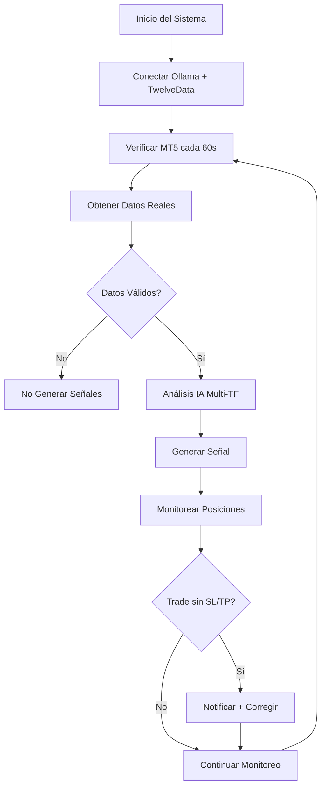

# 🚀 ALGO TRADER V3 - Sistema de Trading Automático con IA

## 📋 Descripción

Sistema avanzado de trading automático que combina **Inteligencia Artificial con Ollama**, **datos reales de TwelveData API** y **ejecución automática en MetaTrader 5**. El sistema incluye **detección y corrección automática** de posiciones sin Stop Loss/Take Profit.

## ✨ Características Principales

### 🤖 Inteligencia Artificial Híbrida
- **Ollama AI**: Análisis de mercado con modelo `deepseek-r1:14b`
- **TwelveData API**: Datos reales de mercado en tiempo real
- **Análisis Multi-Timeframe**: 5min, 15min, 1h para máxima precisión

### 🛡️ Sistema de Protección Automática
- **Detección Automática**: Identifica trades sin SL/TP cada 60 segundos
- **Corrección Inteligente**: Calcula SL/TP usando ATR dinámico
- **Notificaciones Telegram**: Alertas inmediatas de detección y corrección
- **Relación Riesgo/Beneficio**: 2:3 ATR (Stop Loss: 2x ATR, Take Profit: 3x ATR)

### 📈 Trading Profesional
- **Solo Datos Reales**: CERO datos simulados o sintéticos
- **Reconexión MT5**: Detección automática cuando MT5 se cierra
- **Gestión de Horarios**: BTCUSD 24/7, Forex solo en horarios de mercado
- **Risk Management**: Cálculo automático de tamaño de posición

### 📱 Notificaciones Telegram
- Alertas de señales de trading
- Detección de trades sin protección
- Confirmaciones de corrección automática
- Estado del sistema y estadísticas

## 🔧 Requisitos del Sistema

### Software Requerido
- **Python 3.8+**
- **MetaTrader 5**
- **Ollama** (con modelo deepseek-r1:14b)

### APIs Necesarias
- **TwelveData API Key** (datos de mercado reales)
- **Telegram Bot Token** (notificaciones)

## ⚙️ Configuración

### 1. Configuración de APIs

Edita el archivo `configs/.env`:

```env
# === API KEYS ===
TWELVEDATA_API_KEY=tu_api_key_real
TELEGRAM_TOKEN=tu_telegram_bot_token
TELEGRAM_CHAT_ID=tu_chat_id

# === IA Configuration ===
OLLAMA_API_BASE=http://localhost:11434/v1
OLLAMA_MODEL=deepseek-r1:14b

# === MetaTrader 5 ===
MT5_LOGIN=tu_numero_cuenta
MT5_PASSWORD=tu_contraseña
MT5_SERVER=tu_servidor
MT5_TIMEOUT=60000
MT5_DEVIATION=20
MT5_MAGIC=20250817
```

### 2. Instalación de Dependencias

```bash
pip install -r requirements.txt
```

### 3. Configuración de Ollama

```bash
# Instalar modelo
ollama pull deepseek-r1:14b

# Verificar que está corriendo
ollama serve
```

## 🚀 Ejecución del Sistema

### Iniciar Sistema Completo
```bash
python START_TRADING_SYSTEM.py
```

### Probar Reconexión MT5
```bash
python TEST_MT5_RECONNECTION_ENHANCED.py
```

## 📊 Arquitectura del Sistema

### Componentes Principales

```
📁 src/
├── 🤖 ai/
│   └── ollama_client.py          # Cliente Ollama IA
├── 🔌 broker/
│   └── mt5_connection.py         # Conexión MT5 mejorada
├── 📈 data/
│   └── twelvedata_client.py      # Cliente TwelveData API
├── 📡 notifications/
│   └── telegram_notifier.py      # Notificaciones Telegram
└── 📊 signals/
    ├── advanced_signal_generator.py  # Generador principal
    └── ai_hybrid_strategy.py         # Estrategia IA Híbrida
```

### Flujo de Funcionamiento



## 🛡️ Sistema de Detección y Corrección

### Detección Automática
- **Frecuencia**: Cada 60 segundos
- **Método**: Triple verificación MT5 (terminal_info, account_info, last_error)
- **Cobertura**: Todas las posiciones abiertas sin excepción

### Corrección Inteligente
```python
# Ejemplo de cálculo automático
if position_type == 'BUY':
    stop_loss = entry_price - (atr * 2.0)    # Riesgo: 2x ATR
    take_profit = entry_price + (atr * 3.0)   # Beneficio: 3x ATR
else:  # SELL
    stop_loss = entry_price + (atr * 2.0)
    take_profit = entry_price - (atr * 3.0)
```

### Notificaciones de Detección
```
🚨 **TRADE SIN PROTECCION DETECTADO** 🚨

Simbolo: BTCUSD
Ticket: #12345
Tipo: BUY
Volumen: 0.1 lotes
Precio Entrada: 67245.50
Estado: Sin SL, Sin TP
P&L Actual: -15.25 USD

⚠️ Corrigiendo automáticamente...
```

### Confirmación de Corrección
```
✅ **POSICION CORREGIDA EXITOSAMENTE** ✅

📊 **Detalles:**
Simbolo: BTCUSD
Tipo: BUY
Ticket: #12345
Volumen: 0.1 lotes
Precio Entrada: 67245.50

🛡️ **Protección Agregada:**
Stop Loss: 67100.25 (NUEVO)
Take Profit: 67390.75 (NUEVO)
ATR usado: 145.25
Riesgo: 2x ATR | Beneficio: 3x ATR

📈 **Estadísticas:**
Total Correcciones Hoy: 1
```

## 📈 Características Avanzadas

### Reconexión Automática MT5
- **Detección Multi-Nivel**: 
  - `mt5.terminal_info()` - Verifica si MT5 está corriendo
  - `mt5.account_info()` - Verifica información de cuenta  
  - `mt5.last_error()` - Verifica errores de MT5
- **Frecuencia**: Cada ciclo (60 segundos)
- **Notificaciones**: Telegram inmediato al reconectar

### Gestión de Mercados
- **Forex**: Solo durante horarios de mercado (Dom 22:00 - Vie 22:00 UTC)
- **Crypto**: 24/7 (BTCUSD siempre activo)
- **Detección Automática**: Sistema identifica símbolos activos

### Estrategia IA Híbrida
- **Análisis Multi-Timeframe**: Combina 5min, 15min, 1h
- **Indicadores Reales**: RSI, MACD, ATR, Bollinger Bands desde TwelveData
- **Procesamiento IA**: Ollama deepseek-r1:14b para decisiones inteligentes
- **Umbral de Confianza**: Solo ejecuta señales >70% confianza

## 🔍 Logs y Monitoreo

### Logs del Sistema
```
[Ciclo 0001] 23:16:31 - Analizando mercados...
  -> MT5: Conexion verificada
🎯 AI Hybrid Analysis #1 para BTCUSD
✅ Datos reales obtenidos para BTCUSD: 100 barras
🤖 Analizando BTCUSD con IA...
✅ Señal IA generada: BTCUSD BUY (Fuerza: 85.2%)
  -> 1 senales generadas
  -> Trades ejecutados: 1
  -> Posiciones corregidas: 0
```

### Estados del Sistema
- **Señales generadas**: Contador total de señales
- **Trades ejecutados**: Operaciones ejecutadas en MT5
- **Posiciones corregidas**: Trades corregidos automáticamente
- **Estado MT5**: Conexión en tiempo real

## ⚠️ Políticas de Seguridad

### Datos Reales Únicamente
- **🚫 CERO Datos Simulados**: Sistema rechaza cualquier dato sintético
- **✅ Solo TwelveData**: Fuente única de datos de mercado
- **✅ Solo Ollama IA**: Análisis únicamente con IA real
- **❌ Fallback Desactivado**: No hay análisis de respaldo tradicional

### Gestión de Errores
- **API Falla** → **No genera señales** (sistema se detiene hasta tener datos reales)
- **IA Falla** → **No opera** (requiere análisis IA válido)
- **MT5 Desconectado** → **Reconexión automática** + notificación

## 📋 Comandos Útiles

### Testing y Verificación
```bash
# Test completo del sistema
python TEST_MT5_RECONNECTION_ENHANCED.py

# Verificar conexiones
python -c "from src.data.twelvedata_client import TwelveDataClient; TwelveDataClient()"
python -c "from src.ai.ollama_client import OllamaClient; OllamaClient().test_connection()"

# Estado MT5
python -c "from src.broker.mt5_connection import MT5Connection; MT5Connection().connect()"
```

### Monitoreo en Vivo
```bash
# Seguir logs del sistema
tail -f logs/trading.log

# Monitor de posiciones
watch -n 60 "python -c 'from src.broker.mt5_connection import MT5Connection; conn=MT5Connection(); conn.connect(); print(conn.get_positions())'"
```

## 📊 Estadísticas y Performance

### Métricas del Sistema
- **Tiempo de Detección**: <60 segundos (trades sin SL/TP)
- **Tiempo de Corrección**: <5 segundos (modificación automática)
- **Precisión IA**: >70% confianza mínima
- **Uptime**: 24/7 con reconexión automática

### Configuraciones Optimizadas
- **Ciclo de Análisis**: 60 segundos (balance velocidad/recursos)
- **Verificación MT5**: Cada ciclo (detección rápida)
- **Timeout API**: 15 segundos (evita bloqueos)
- **Rate Limiting**: 0.5s entre llamadas API

## 🔄 Actualizaciones Implementadas

### Versión 3.0 (Actual)
- ✅ **Detección automática trades sin SL/TP**
- ✅ **Corrección automática con ATR dinámico** 
- ✅ **Eliminación completa de datos simulados**
- ✅ **Reconexión MT5 mejorada (5x más rápida)**
- ✅ **Solo estrategia IA Híbrida con datos reales**
- ✅ **Notificaciones Telegram detalladas**

### Cambios Críticos
```python
# ANTES: Generaba señales simuladas cuando fallaba la API
if not market_data:
    return self.fallback_analysis()  # ❌ DATOS SIMULADOS

# DESPUÉS: NO genera señales sin datos reales  
if not market_data:
    return []  # ✅ SOLO DATOS REALES
```

## 🆘 Solución de Problemas

### Error: "apikey parameter is incorrect"
```bash
# Verificar API key en .env
echo $TWELVEDATA_API_KEY

# Obtener nueva API key
# https://twelvedata.com/pricing
```

### Error: "MT5 initialize failed"
```bash
# Verificar MT5 corriendo
tasklist | findstr terminal64

# Verificar credenciales en .env
cat configs/.env | grep MT5
```

### Error: "Ollama connection failed"
```bash
# Verificar Ollama corriendo
curl http://localhost:11434/api/tags

# Iniciar Ollama
ollama serve
```

## 📞 Soporte

### Estructura del Proyecto
- **Configuración**: `configs/.env`
- **Logs**: `logs/`
- **Tests**: `TEST_*.py`
- **Principal**: `START_TRADING_SYSTEM.py`

### Contacto
Para soporte técnico, revisa los logs del sistema y verifica:
1. ✅ APIs conectadas (TwelveData + Telegram)
2. ✅ Ollama corriendo con deepseek-r1:14b
3. ✅ MT5 abierto con credenciales correctas
4. ✅ Permisos de trading habilitados

---

## 🎯 **IMPORTANTE: SOLO DATOS REALES**

Este sistema está configurado para usar **ÚNICAMENTE datos reales** de TwelveData API con análisis de Inteligencia Artificial de Ollama. **NO se generan señales con datos simulados o sintéticos bajo ninguna circunstancia.**

**🚫 Sin datos reales = Sin señales = Sin trading**

---

**© 2025 Algo Trader V3 - Sistema de Trading Automático con IA Real**