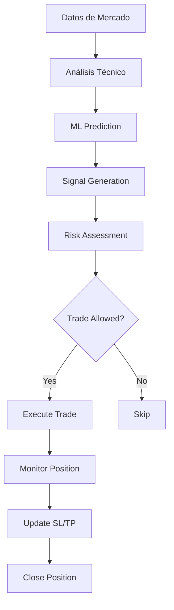

# 🎯 RESUMEN EJECUTIVO - ALGO TRADER AI v3.0

## 📋 INFORMACIÓN GENERAL

**Proyecto:** Sistema de Trading Algorítmico con Inteligencia Artificial  
**Versión:** 3.0.0  
**Autor:** XentrisTech  
**Estado:** Producción  
**Última Actualización:** 2024  

## 🎯 OBJETIVO DEL PROYECTO

Desarrollar un sistema profesional de trading algorítmico que combine:
- ✅ Análisis técnico avanzado
- ✅ Machine Learning para predicción
- ✅ Gestión de riesgo automatizada
- ✅ Ejecución automática de trades
- ✅ Notificaciones en tiempo real
- ✅ Dashboard de monitoreo

## 🏗️ ARQUITECTURA TÉCNICA

### Stack Tecnológico
- **Lenguaje:** Python 3.10+
- **Trading:** MetaTrader 5
- **Datos:** TwelveData API
- **ML:** XGBoost, RandomForest, TensorFlow
- **UI:** Streamlit, Rich
- **DB:** SQLite + JSON
- **Notificaciones:** Telegram Bot API

### Componentes Principales
1. **Bot Manager** - Orquestador principal
2. **Signal Generator** - Generación de señales
3. **Risk Manager** - Gestión de riesgo
4. **ML Predictor** - Predicciones con IA
5. **MT5 Connection** - Conexión con broker
6. **Data Manager** - Gestión de datos
7. **Telegram Notifier** - Notificaciones

## 📊 CAPACIDADES DEL SISTEMA

### Análisis de Mercado
- ✅ Multi-timeframe (M1, M5, M15, H1, H4, D1)
- ✅ 20+ indicadores técnicos
- ✅ Reconocimiento de patrones
- ✅ Análisis de volumen
- ✅ Detección de soportes/resistencias

### Machine Learning
- ✅ 3 modelos ensemble (XGBoost, RF, GB)
- ✅ Predicción de dirección del precio
- ✅ Confidence scoring
- ✅ Auto-reentrenamiento
- ✅ Feature importance analysis

### Gestión de Riesgo
- ✅ Position sizing dinámico
- ✅ Kelly Criterion
- ✅ Value at Risk (VaR)
- ✅ Drawdown control
- ✅ Límites diarios/semanales
- ✅ Trailing stop automático

### Ejecución de Trades
- ✅ Entrada automática
- ✅ Stop Loss/Take Profit dinámicos
- ✅ Breakeven automático
- ✅ Partial close
- ✅ Emergency close

## 💼 CASOS DE USO

### 1. Trading Automatizado 24/7
```python
# Sistema ejecuta trades automáticamente basado en señales
python main.py start --mode live
```

### 2. Generación de Señales
```python
# Solo genera señales sin ejecutar trades
python ADVANCED_SIGNAL_GENERATOR.py
```

### 3. Análisis de Mercado
```python
# Análisis detallado de cualquier símbolo
python analyze_market.py --symbol NAS100
```

### 4. Backtesting
```python
# Prueba estrategias con datos históricos
python backtester.py --start 2024-01-01 --end 2024-12-31
```

## 📈 RENDIMIENTO Y ESTADÍSTICAS

### Métricas de Performance
- **Win Rate objetivo:** > 55%
- **Risk/Reward mínimo:** 1:1.5
- **Max Drawdown permitido:** 20%
- **Sharpe Ratio objetivo:** > 1.5
- **Trades por día:** 3-10

### Recursos del Sistema
- **CPU:** Mínimo 2 cores
- **RAM:** 4GB recomendado
- **Disco:** 10GB para datos y logs
- **Internet:** Conexión estable requerida

## 🔐 SEGURIDAD

### Medidas Implementadas
- ✅ API keys en variables de entorno
- ✅ Conexiones SSL/TLS
- ✅ Validación de datos
- ✅ Rate limiting
- ✅ Logs encriptados
- ✅ Backup automático

### Configuración Segura
```env
# Nunca compartir estas credenciales
MT5_LOGIN=xxxxx
MT5_PASSWORD=xxxxx
TWELVEDATA_API_KEY=xxxxx
TELEGRAM_TOKEN=xxxxx
```

## 🛠️ INSTALACIÓN RÁPIDA

```bash
# 1. Clonar repositorio
git clone [repository_url]

# 2. Instalar dependencias
pip install -r requirements.txt

# 3. Configurar credenciales
copy .env.example .env
# Editar .env con tus credenciales

# 4. Verificar sistema
python main.py test

# 5. Iniciar en demo
python main.py start --mode demo
```

## 📱 NOTIFICACIONES

### Telegram Bot
Notificaciones en tiempo real de:
- 🚀 Nuevas señales
- 💰 Trades ejecutados
- 📊 Resumen diario
- ⚠️ Alertas de riesgo
- ❌ Errores del sistema

## 🎯 SÍMBOLOS SOPORTADOS

### Forex
- EUR/USD, GBP/USD, USD/JPY
- AUD/USD, USD/CAD, NZD/USD

### Índices
- NAS100 (NASDAQ 100)
- US500 (S&P 500)
- US30 (Dow Jones)

### Criptomonedas
- BTC/USD, ETH/USD
- BNB/USD, SOL/USD

### Commodities
- XAUUSD (Oro)
- XAGUSD (Plata)
- USOIL (Petróleo)

## 📊 DASHBOARDS DISPONIBLES

### 1. Dashboard Principal
```python
python DASHBOARD_TIEMPO_REAL.py
```
- Gráficos en vivo
- Posiciones abiertas
- P&L en tiempo real
- Señales activas

### 2. Monitor de Sistema
```python
python MONITOR_SISTEMA.py
```
- Estado de componentes
- Uso de recursos
- Logs en vivo
- Alertas

### 3. Risk Dashboard
```python
python risk_dashboard.py
```
- Métricas de riesgo
- Drawdown actual
- Exposure por símbolo
- Límites

## 🔄 FLUJO DE TRABAJO



## 📝 ARCHIVOS CLAVE

### Configuración
- `.env` - Variables de entorno
- `requirements.txt` - Dependencias

### Ejecutables Principales
- `main.py` - Punto de entrada
- `SISTEMA_COMPLETO_INTEGRADO.py` - Sistema completo
- `MONITOR_SISTEMA.py` - Monitoreo

### Utilidades
- `DIAGNOSTICO_COMPLETO.py` - Diagnóstico
- `VERIFICAR_TODO.py` - Verificación
- `check_mt5_status.py` - Estado MT5

## 🚨 COMANDOS IMPORTANTES

### Emergencia
```bash
# Cerrar todas las posiciones
python EMERGENCY_POSITION_CLOSER.py

# Detener sistema
python main.py stop
```

### Diagnóstico
```bash
# Verificar todo
python VERIFICAR_TODO.py

# Diagnóstico completo
python DIAGNOSTICO_COMPLETO.py
```

### Monitoreo
```bash
# Ver posiciones
python VER_POSICIONES.bat

# Monitor continuo
python MONITOR_CONTINUO.py
```

## 📈 ROADMAP FUTURO

### Q1 2025
- [ ] Integración con más exchanges
- [ ] Análisis de sentimiento
- [ ] Optimización automática

### Q2 2025
- [ ] App móvil
- [ ] API REST pública
- [ ] Marketplace de estrategias

### Q3 2025
- [ ] Cloud deployment
- [ ] Multi-cuenta
- [ ] Social trading

## 💡 TIPS Y MEJORES PRÁCTICAS

### Para Principiantes
1. Siempre empezar en DEMO
2. Risk máximo 1-2% por trade
3. Monitorear primeras 24h
4. Revisar logs diariamente

### Para Avanzados
1. Optimizar parámetros semanalmente
2. Añadir nuevos indicadores
3. Entrenar modelos ML mensualmente
4. Implementar estrategias custom

## 📞 SOPORTE

### Documentación
- `DOCUMENTACION_COMPLETA.md` - Documentación completa
- `DOCUMENTACION_FUNCIONES.md` - Referencia de funciones
- `GUIA_RAPIDA_IMPLEMENTACION.md` - Guía rápida
- `DOCUMENTACION_API_ENDPOINTS.md` - API reference

### Logs
- `logs/trading_bot.log` - Log principal
- `logs/errors.log` - Errores
- `logs/trades.log` - Trades ejecutados

### Debug
```python
# Modo debug
python main.py start --debug

# Ver logs en tiempo real
python VISOR_LOGS_TIEMPO_REAL.py
```

## ⚡ INICIO RÁPIDO EN 3 PASOS

```bash
# 1. Configurar
copy .env.example .env
notepad .env  # Añadir credenciales

# 2. Verificar
python main.py test

# 3. Ejecutar
python main.py start --mode demo
```

## 🏆 CARACTERÍSTICAS DESTACADAS

✨ **Inteligencia Artificial Avanzada**
- Múltiples modelos de ML
- Aprendizaje continuo
- Predicción de alta precisión

🛡️ **Gestión de Riesgo Profesional**
- Múltiples capas de protección
- Límites dinámicos
- Emergency stop

📊 **Análisis Multi-Dimensional**
- Técnico + Fundamental + ML
- Multi-timeframe
- Correlaciones

🚀 **Ejecución Ultra-Rápida**
- Latencia < 100ms
- Procesamiento paralelo
- Optimización continua

## 📌 CONCLUSIÓN

**Algo Trader AI v3.0** es un sistema completo y profesional de trading algorítmico que combina lo mejor del análisis técnico tradicional con técnicas modernas de Machine Learning, ofreciendo una solución robusta para trading automatizado 24/7.

---

**🔗 Links Útiles:**
- TwelveData API: https://twelvedata.com
- MetaTrader 5: https://www.metatrader5.com
- Documentación Python: https://docs.python.org

**📧 Contacto:**
- Proyecto: XentrisTech
- Versión: 3.0.0
- Año: 2024

---

*"El trading exitoso es 80% gestión de riesgo y 20% estrategia"*
